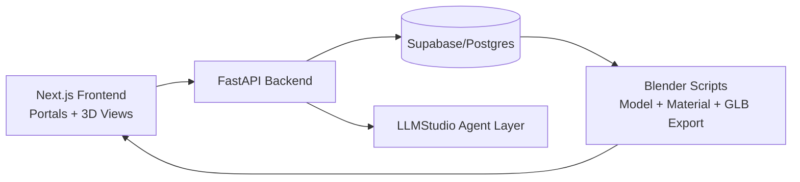

# Dynasty PropertyOS

Dynasty PropertyOS is a real-estate operating system that combines:

- FastAPI backend services
- Next.js frontend portals
- Blender-based digital twin generation
- Supabase/Postgres data workflows
- LLMStudio multi-agent configuration

It is designed to support investors, contractors, appraisers, lenders, and property managers from acquisition to reporting.

## What Is In This Repository

- Backend API: `backend/app/main.py`
- Frontend app: `frontend/app/page.tsx`
- Blender scripts: `blender/scripts/`
- Database migrations/seeds: `database/migrations/`, `database/seeds/`
- LLMStudio agent configs: `ai_agents/llmstudio/`
- Product documentation: `docs/`

## Product Documents

- Vision: `docs/PRODUCT_VISION.md`
- Master plan: `docs/PROPERTYOS_MASTER_BUILD_PLAN.md`
- Security policy: `docs/SECURITY_AUDIT_POLICY.md`
- Docs index: `docs/README.md`

## High-Level Architecture



## Prerequisites

- Python 3.12+
- Node.js 22+
- npm
- Blender 4.x (for 3D generation workflows)
- Optional: Supabase CLI

## Environment Setup

1. Copy `.env.example` to `.env` and fill values as needed.
2. Frontend local env is read from `frontend/.env.local`.

Important variables in `.env`:

- `NEXT_PUBLIC_API_BASE_URL`
- `CORS_ALLOW_ORIGINS`
- `N8N_DYNASTY_API_URL`
- `RAILWAY_BACKEND_PUBLIC_URL`
- `RAILWAY_FRONTEND_PUBLIC_URL`
- `LLMSTUDIO_BASE_URL`
- `LLMSTUDIO_DEFAULT_MODEL`
- `LLMSTUDIO_API_KEY`
- `LLMSTUDIO_TIMEOUT_SECONDS`
- `CODEPLOIT_ENABLED`

### Frontend/Backend/N8N/Railway Sync Matrix

- Local frontend to backend:
  `NEXT_PUBLIC_API_BASE_URL=http://127.0.0.1:8000`
- Docker frontend to backend:
  `NEXT_PUBLIC_API_BASE_URL_DOCKER=http://api:8000`
- N8N to backend (local):
  `N8N_DYNASTY_API_URL=http://localhost:8010`
- N8N to backend (docker):
  `N8N_DYNASTY_API_URL_DOCKER=http://api:8000`
- Railway deployment:
  set `RAILWAY_BACKEND_PUBLIC_URL` and use that same URL for both `NEXT_PUBLIC_API_BASE_URL` and `N8N_DYNASTY_API_URL`.

The n8n workflow `ultimate-dynasty-os-v2.json` is configured to read `N8N_DYNASTY_API_URL` through the Dynasty Config node, so all API tool nodes stay in sync with one value.

## Local Development

### Option A: Run from VS Code tasks

Available tasks:

- `Run backend API`
- `Run frontend`
- `Run Blender generator`
- `Validate LLMStudio setup`

### Option B: Run manually

Backend:

```bash
python -m uvicorn backend.app.main:app --reload --host 0.0.0.0 --port 8000
```

Frontend:

```bash
cd frontend
npm install
npm run dev
```

Blender generator:

```bash
python scripts/run_blender_local.py
```

Open:

- Frontend: http://127.0.0.1:3000
- API docs: http://127.0.0.1:8000/docs

## Docker Compose (Dev)

The root `docker-compose.yml` starts:

- `postgres` on port `5433`
- `redis` on port `6379`
- `api` on port `8010`
- `frontend` on port `3005`
- `n8n` on port `5678`
- background workers: `ai_worker`, `blender_worker`

Run:

```bash
docker compose up --build
```

Then open:

- Frontend: http://127.0.0.1:3005
- API docs: http://127.0.0.1:8010/docs
- n8n: http://127.0.0.1:5678

One-command container healthcheck:

```bash
python scripts/healthcheck_containers.py
```

Configuration sync validator:

```bash
python scripts/validate_stack_sync.py --env-file .env
```

## API Endpoints (Current)

From `backend/app/main.py`:

- `GET /`
- `GET /health`
- `GET /api/llmstudio/config`
- `GET /api/llmstudio/health`
- `POST /api/investor/flip-analysis`
- `GET /api/investor/market-snapshot`

## Quality Checks

Windows Command Prompt:

```bat
scripts\verify_all.bat
```

PowerShell:

```powershell
./scripts/verify_all.ps1
```

These checks run:

- Frontend type/lint (`npm run lint`)
- Frontend production build (`npm run build`)
- Backend investor flow tests (`python -m unittest -q tests.test_investor_flow`)

## LLMStudio Integration

Config files:

- `ai_agents/llmstudio/agents.json`
- `ai_agents/llmstudio/assistants.json`
- `ai_agents/llmstudio/codeploit.json`

Validation command:

```bash
python scripts/validate_llmstudio_setup.py
```

## Blender Workflow

Core scripts:

- `blender/scripts/propertyos_blender_starter.py`
- `blender/scripts/material_swap_from_db_export.py`
- `blender/scripts/export_glb.py`

Typical pipeline:

1. Generate a baseline model.
2. Apply material updates from data export.
3. Export GLB for web viewing.

## Database Workflow

- Main schema migration: `database/migrations/001_dynasty_propertyos_schema.sql`
- Seed data: `database/seeds/seed_usda_1bedroom.sql`

If using Supabase CLI:

```bash
supabase db reset
```

## Frontend Routes

Primary route entrypoints:

- `/` command center
- `/investor`
- `/appraiser`
- `/contractor`
- `/lender`
- `/property-manager`
- `/walkthrough`

## Repository Map

Top-level functional areas:

- `backend/` API services
- `frontend/` Next.js application and portals
- `blender/` assets, scripts, exports
- `database/` migrations, seeds, reports
- `ai_agents/` domain agents and orchestrator configs
- `accounting/` accounting data structure
- `blockchain/` contracts, metadata, passport artifacts
- `docs/` product and implementation docs
- `scripts/` verification and utility scripts
- `tests/` backend tests

## Current Status

The repository is set up as a multi-module foundation with working API endpoints, frontend routes, Blender scripts, and validation scripts. The next focus areas are deeper service integration, richer workflows, and production hardening.
